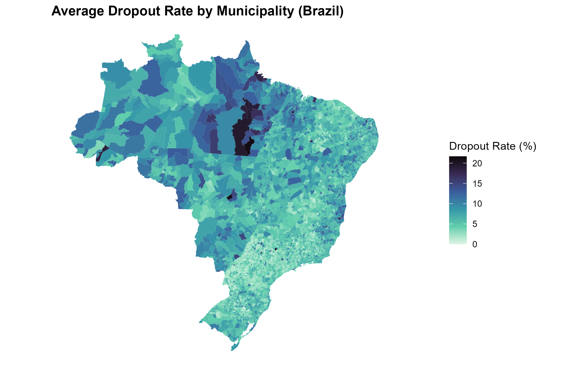
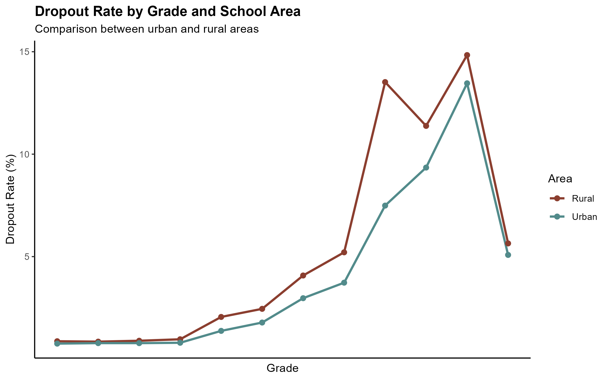
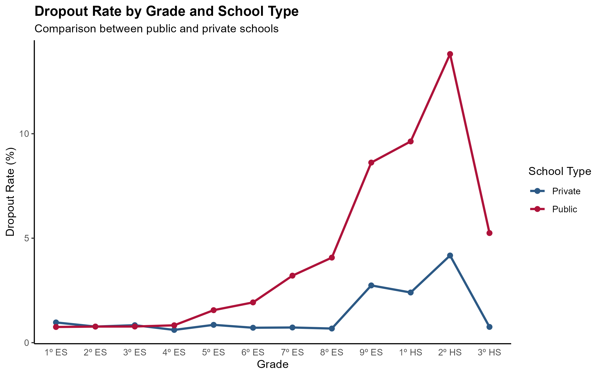
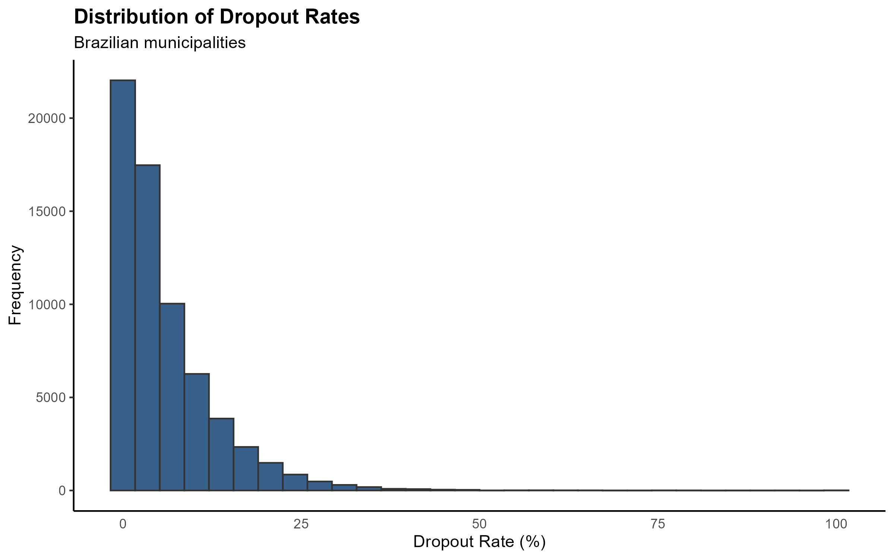
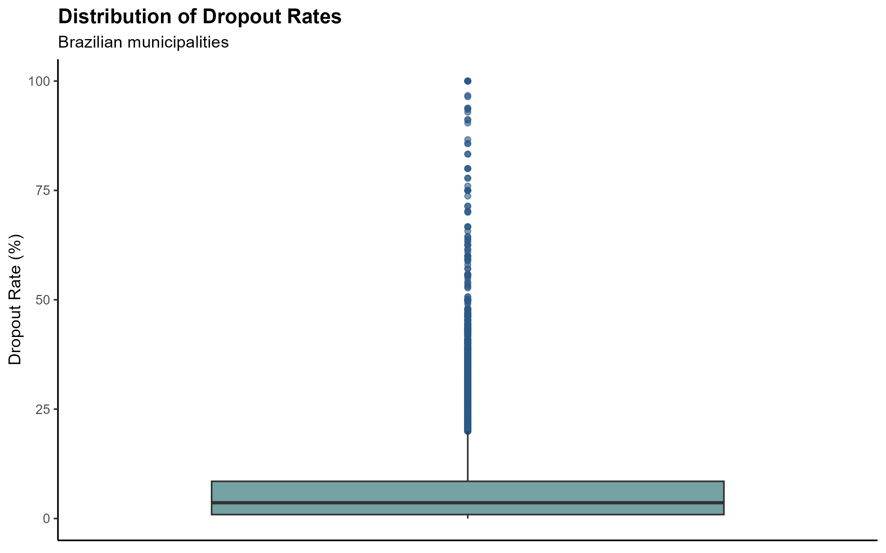
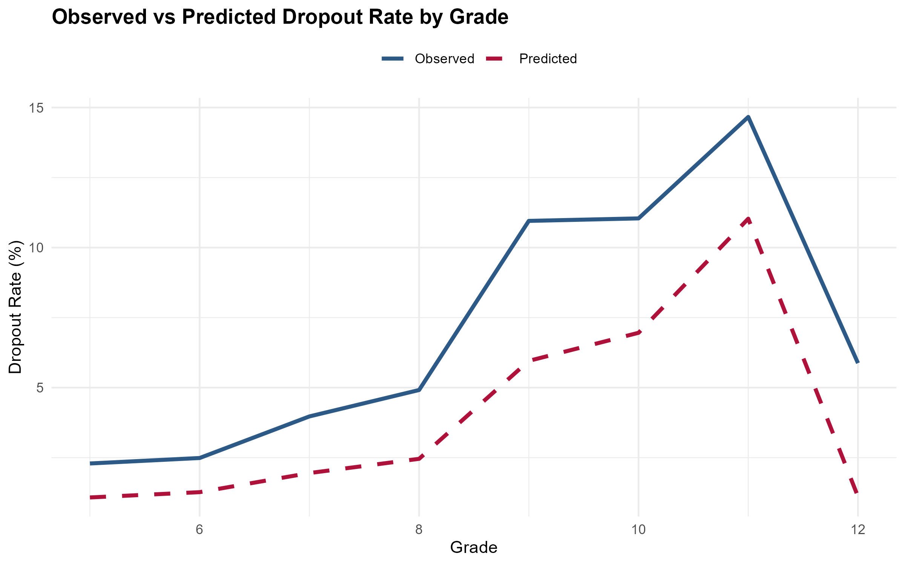

# Predicting School Dropout in Brazil

## Overview

School dropout is a multidimensional phenomenon that directly impacts educational development, workforce qualification, and broader social indicators in Brazil. Understanding its structural patterns is essential for designing effective educational policies and intervention strategies.

This project investigates school dropout behavior across Brazilian municipalities using official educational flow indicators from the Brazilian National Institute of Educational Studies and Research (INEP), focusing on identifying spatial, structural, and educational patterns associated with student dropout.

---

## Objective

The main objective of this study is to analyze the determinants of school dropout rates in Brazil and identify the school stages most associated with higher dropout risk.

Specifically, this project aims to:

- Explore dropout distribution across municipalities;
- Compare dropout behavior by school area (urban and rural);
- Compare dropout behavior by school dependency (public and private);
- Evaluate the relationship between dropout and repetition rates;
- Estimate dropout patterns using robust machine learning models.

---

## Dataset

**Source:** INEP — Educational Flow Indicators (2021–2022)

The dataset contains municipal-level educational indicators across Brazil.

### Variables

#### Identification Variables

- `REGIAO`: Brazilian region  
- `UF`: State  
- `COD_MUNIC`: Municipality code  
- `MUNIC`: Municipality name  
- `AREA`: School area (urban or rural)  
- `DEPENDENCIA`: School dependency (public or private)

#### Educational Indicators

- `TPROM`: Promotion Rate  
- `TREP`: Repetition Rate  
- `TEV`: Dropout Rate  
- `SERIE`: School grade

---

## Data Cleaning

Before analysis, the original Excel dataset required preprocessing:

- Removal of non-tabular headers and embedded image elements;
- Restructuring merged cells;
- Renaming variables into analytical format;
- Converting character variables into numeric format;
- Reshaping data into long format for grade-level analysis.

---

## Exploratory Data Analysis (EDA)

The exploratory analysis focused on understanding dropout patterns by geography and school structure.

### 1. Spatial Distribution of Dropout Rates

Figure 1 shows the average dropout rate by municipality across Brazil.



The spatial distribution reveals strong regional heterogeneity, with higher concentrations of dropout rates in the Northern region, particularly in Pará.

---

### 2. Dropout by School Area

Figure 2 compares dropout behavior between urban and rural schools.



The results indicate distinct dropout trajectories across school locations, suggesting structural differences related to infrastructure, accessibility, and local socioeconomic conditions.

---

### 3. Dropout by School Dependency

Figure 3 compares public and private schools.



Public schools consistently show higher dropout rates across grades, although both systems exhibit critical transition points.

---

### 4. Distribution Analysis

Figure 4 presents the distribution of dropout rates.



Figure 5 presents the boxplot of dropout rates.



The distribution is positively skewed and contains several outliers, indicating violation of standard linear regression assumptions.

---

## Modeling

Given the asymmetric distribution and presence of outliers, robust regression methods were adopted.

### Models Tested

- Linear Regression  
- Decision Tree  
- Random Forest  
- Huber Regression  
- Robust Linear Regression (`lmrob`)

### Features Used

- `TREP` (Repetition Rate)  
- `SERIE` (School Grade)

### Target Variable

- `TEV` (Dropout Rate)

---

## Model Performance

| Model | MAE | MedAE |
|---|---:|---:|
| Random Forest | 3.50 | 2.28 |
| Huber Regression | 3.54 | 2.2 |
| Robust Regression (`lmrob`) | 3.54 | 2.15 |
| Decision Tree | 3.88 | 3.20 |

Random Forest achieved the best Mean Absolute Error (MAE), while Robust Regression achieved the best Median Absolute Error (MedAE), indicating stronger resistance to outliers.

---

## Model Interpretation

Robust regression identified two major predictors of school dropout:

- School grade progression;
- Repetition rate.

Results indicate that:

- A 1 percentage point increase in repetition rate is associated with an average increase of approximately 0.12 percentage points in dropout rate;
- Dropout risk increases progressively throughout the school trajectory;
- The highest dropout effects are concentrated in:
  - 9th grade of Elementary School;
  - 1st year of High School;
  - 2nd year of High School.

These findings suggest that school progression has stronger predictive power than repetition rate alone.

---

## Model Fit

Figure 6 compares observed and predicted dropout rates.



The robust model successfully captures the overall dropout trend across grades, particularly the transition points between educational stages. However, it tends to underestimate higher dropout levels, suggesting the presence of additional structural factors not included in the model.

---

## Key Findings

- School dropout increases significantly in later grades;
- Public schools exhibit higher dropout rates than private schools;
- Rural schools tend to present higher dropout rates than urban schools;
- Repetition rate is positively associated with dropout;
- Grade progression is the strongest predictor of dropout.

---

## Technologies Used

- R  
- tidyverse  
- ggplot2  
- sf  
- geobr  
- MASS  
- robustbase  
- randomForest  
- rpart

---

## Project Structure

```text
├── data
│   ├── raw
│   └── processed
├── scripts
│   ├── 01_data_cleaning.R
│   ├── 02_eda.R
│   └── 03_modeling.R
├── outputs
│   ├── figures
│   └── tables
├── docs
│   └── data_dictionary.md
└── README.md